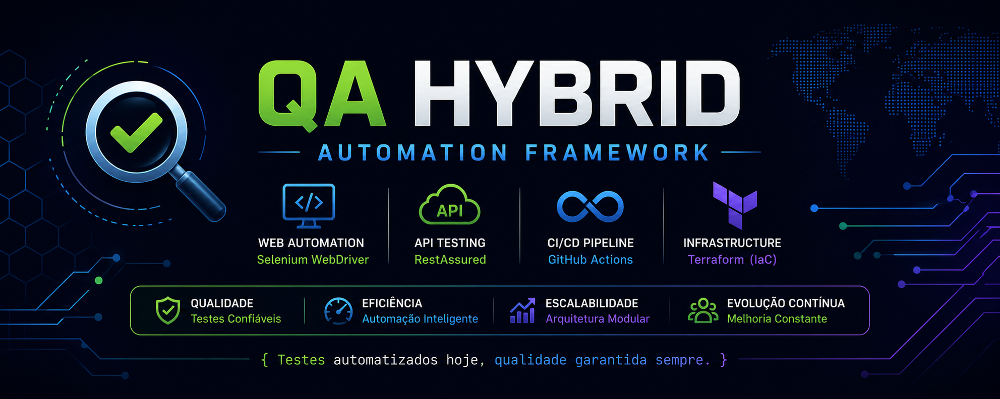
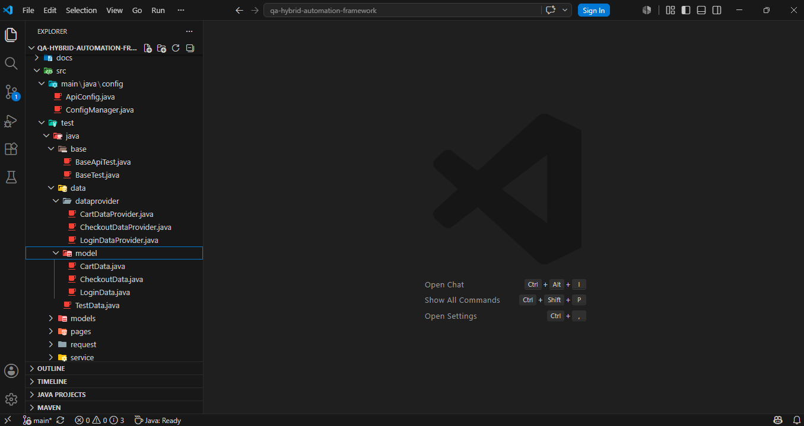
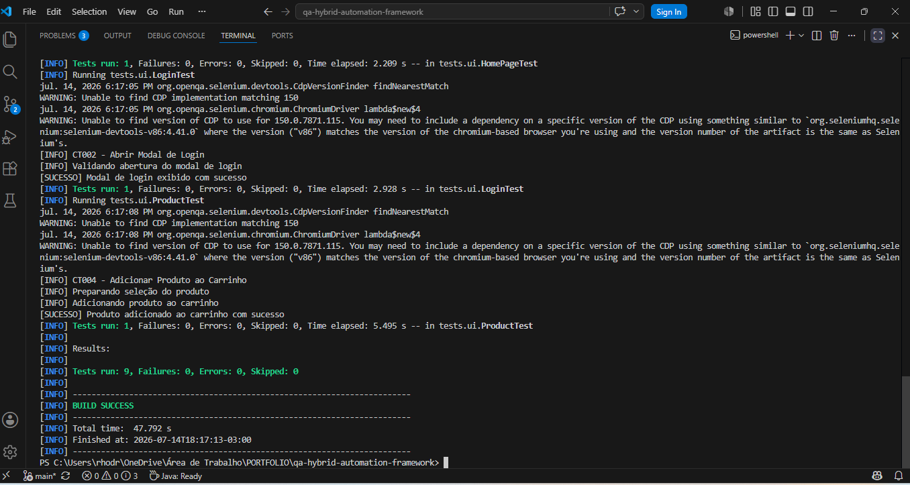
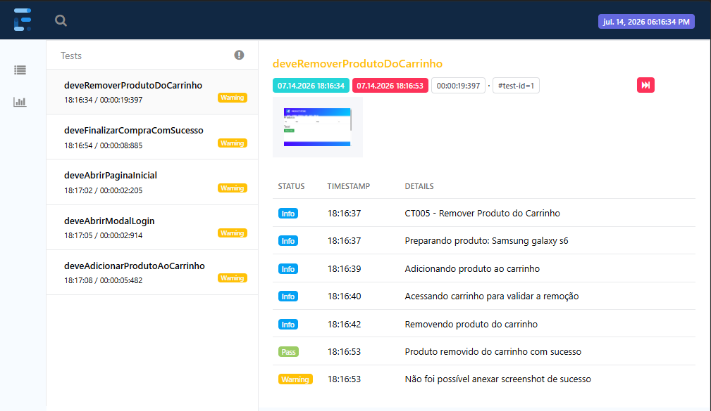
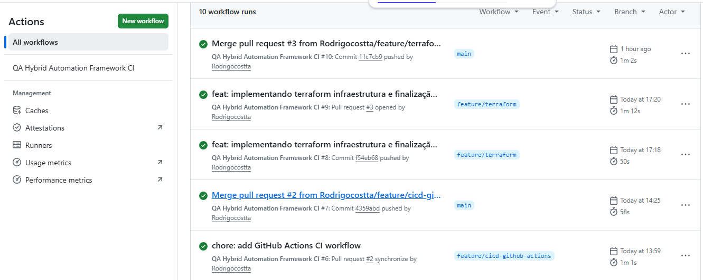

<p align="center">
  
</p>
# QA Hybrid Automation Framework


Framework de automação de testes desenvolvido para consolidar conhecimentos em Quality Assurance Automation, aplicando boas práticas de mercado, arquitetura escalável e evolução contínua.

Framework híbrido de automação de testes desenvolvido em **Java 21**, aplicando boas práticas de engenharia de software, arquitetura escalável e conceitos utilizados em ambientes profissionais de QA Automation.

O projeto contempla automação **Web (UI)**, **API Testing**, geração de relatórios, evidências automatizadas, integração contínua através de pipeline CI/CD e práticas de **Infrastructure as Code (IaC)** utilizando Terraform.

O objetivo é demonstrar uma arquitetura completa de automação, aproximando o projeto de cenários reais encontrados em times de qualidade.

---

# Objetivo do Projeto

Construir um framework híbrido de automação capaz de suportar:

* Testes Web utilizando Selenium WebDriver;
* Testes de API utilizando RestAssured;
* Organização baseada em Page Object Model;
* Execução automatizada via Maven;
* Relatórios de execução;
* Captura automática de evidências;
* Integração contínua com GitHub Actions;
* Conceitos de Infrastructure as Code utilizando Terraform.

Além do aspecto técnico, o projeto serve como portfólio profissional para demonstração de conhecimentos em QA Automation.

---

# Features

## 🌐 Web Automation

- ✅ Selenium WebDriver 4
- ✅ Page Object Model (POM)
- ✅ JUnit
- ✅ WebDriverManager
- ✅ Captura automática de screenshots
- ✅ Testes funcionais

## 🔌 API Automation

- ✅ RestAssured
- ✅ Validação de endpoints
- ✅ Testes HTTP (GET, POST, PUT e DELETE)
- ✅ Organização em classes base

## 📊 Reporting

- ✅ ExtentReports
- ✅ Logs de execução
- ✅ Evidências automáticas
- ✅ Screenshots em falhas

## ⚙️ CI/CD

- ✅ GitHub Actions
- ✅ Pipeline automatizada
- ✅ Build Maven
- ✅ Execução automática dos testes

## 🏗️ Infrastructure as Code

- ✅ Terraform
- ✅ Local Provider
- ✅ Variables
- ✅ Outputs
- ✅ Resource Management

# Screenshots

## Estrutura do Projeto



---

## Execução dos Testes



---

## Extent Reports



---

## GitHub Actions



# Arquitetura do Framework

```text
QA Hybrid Automation Framework

                Test Automation

                      |
        --------------------------------
        |                              |
        v                              v

   UI Automation                 API Automation

 Selenium WebDriver              RestAssured

        |                              |
        --------------------------------

                      |
                      v

              JUnit Test Execution

                      |
                      v

              ExtentReports

                      |
                      v

             GitHub Actions CI/CD

                      |
                      v

              Terraform IaC
```

---

# Aplicação Utilizada

Os testes Web foram desenvolvidos utilizando a aplicação:

```
https://www.demoblaze.com
```

---

# Tecnologias Utilizadas

## Linguagem

* Java 21

## Automação Web

* Selenium WebDriver 4

## Automação API

* RestAssured

## Framework de Testes

* JUnit 4
* JUnit 5

## Gerenciamento de Dependências

* Maven

## Gerenciamento de Drivers

* WebDriverManager

## Relatórios e Evidências

* ExtentReports
* ScreenshotUtils

## Controle de Versão

* Git
* GitHub

## CI/CD

* GitHub Actions

## Infrastructure as Code

* Terraform

---

# Estrutura do Projeto

```text
qa-hybrid-automation-framework

├── .github
│   └── workflows
│       └── ci.yml
│
├── docs
│   ├── 01-escopo-do-projeto.md
│   ├── 02-estrategia-de-testes.md
│   ├── 03-cenarios-de-teste.md
│   ├── 04-matriz-de-rastreabilidade.md
│   ├── 05-casos-de-teste.md
│   └── 06-decisoes-tecnicas.md
│
├── src
│   ├── main
│   └── test
│       └── java
│           ├── base
│           ├── config
│           ├── data
│           ├── pages
│           ├── tests
│           └── utils
│
├── terraform
│   ├── provider.tf
│   ├── variables.tf
│   ├── main.tf
│   ├── outputs.tf
│   └── README.md
│
├── pom.xml
└── README.md
```

---

# Arquitetura de Código

## Base

Contém classes reutilizáveis do framework.

Responsabilidades:

* Inicialização do WebDriver;
* Configuração do ambiente;
* Comportamentos compartilhados.

Exemplos:

* BaseTest
* BasePage

---

## Config

Centraliza configurações utilizadas pelo framework.

Exemplo:

* Config

---

## Data

Centralização de dados utilizados nos testes.

Exemplo:

* TestData

---

## Pages

Implementação do padrão:

```
Page Object Model (POM)
```

Cada página representa seus próprios elementos e comportamentos.

Exemplos:

* HomePage
* LoginPage
* ProductPage
* CartPage
* CheckoutPage

---

## Tests

Contém os cenários automatizados.

Exemplos:

* LoginTest
* ProductTest
* CartTest
* CheckoutTest
* API Tests

---

## Utils

Componentes auxiliares reutilizáveis.

Exemplos:

* WaitUtils
* LogUtils
* ScreenshotUtils

---

# Funcionalidades Automatizadas

## UI Automation

### Login

* Abertura do modal de login;
* Login com usuário válido;
* Validação de autenticação.

### Produtos

* Seleção de produtos;
* Validação de informações.

### Carrinho

* Adição de produtos;
* Validação dos itens;
* Remoção de produtos.

### Checkout

* Preenchimento do formulário;
* Finalização da compra;
* Validação da mensagem de sucesso.

---

## API Automation

Implementação de testes utilizando RestAssured.

Cobertura:

* Validação de endpoints;
* Requisições HTTP;
* Validação de respostas;
* Organização através de classes base.

---

# Padrões e Boas Práticas Aplicadas

O projeto utiliza:

* Page Object Model (POM);
* Separação de responsabilidades;
* Código reutilizável;
* Centralização de configurações;
* Organização por camadas;
* Versionamento Git;
* Commits semânticos;
* Branches por funcionalidade;
* Infraestrutura versionada como código.

---

# CI/CD Pipeline

O projeto possui integração contínua utilizando GitHub Actions.

Fluxo:

```text
Push / Pull Request

        |
        v

GitHub Actions

        |
        v

Build Maven

        |
        v

Execução dos testes

        |
        v

Geração de relatório
```

---

# Infrastructure as Code (Terraform)

O projeto possui um módulo Terraform demonstrando conceitos de IaC.

Conceitos aplicados:

* Providers;
* Resources;
* Variables;
* Outputs;
* terraform init;
* terraform validate;
* terraform plan.

O módulo utiliza Terraform Local Provider para permitir execução sem dependências externas.

Mais detalhes:

```
terraform/README.md
```

---

# Relatórios e Evidências

Durante a execução dos testes são gerados:

* Relatórios HTML;
* Logs de execução;
* Screenshots em falhas;
* Evidências para análise.

---

# Como Executar o Projeto

## Clonar o repositório

```bash
git clone git@github.com:Rodrigocostta/qa-hybrid-automation-framework.git
```

---

## Acessar o projeto

```bash
cd qa-hybrid-automation-framework
```

---

## Executar testes

```bash
mvn test
```

---

## Executar Terraform

Acessar:

```bash
cd terraform
```

Inicializar:

```bash
terraform init
```

Validar:

```bash
terraform validate
```

Visualizar plano:

```bash
terraform plan
```

---

# Roadmap do Projeto

## Fase 1 — UI Automation

✅ Selenium WebDriver
✅ Page Object Model
✅ Testes funcionais

---

## Fase 2 — Relatórios e Evidências

✅ ExtentReports
✅ Logs
✅ Screenshots automáticos

---

## Fase 3 — API Automation

✅ RestAssured
✅ Testes de endpoints
✅ Integração API

---

## Fase 4 — CI/CD

✅ GitHub Actions
✅ Execução automática dos testes

---

## Fase 5 — Infrastructure as Code

✅ Terraform
✅ Provider
✅ Resources
✅ Variables
✅ Outputs

---

# Próximas Evoluções

Possíveis melhorias futuras:

* Execução paralela de testes;
* Dockerização do ambiente;
* Integração com Allure Reports;
* Execução em ambientes cloud;
* Testes de performance;
* Estratégias avançadas de pipeline.

---

# Autor

## Rodrigo Costa

Projeto desenvolvido para evolução profissional em QA Automation, aplicação de boas práticas de engenharia de testes e construção de portfólio técnico.
